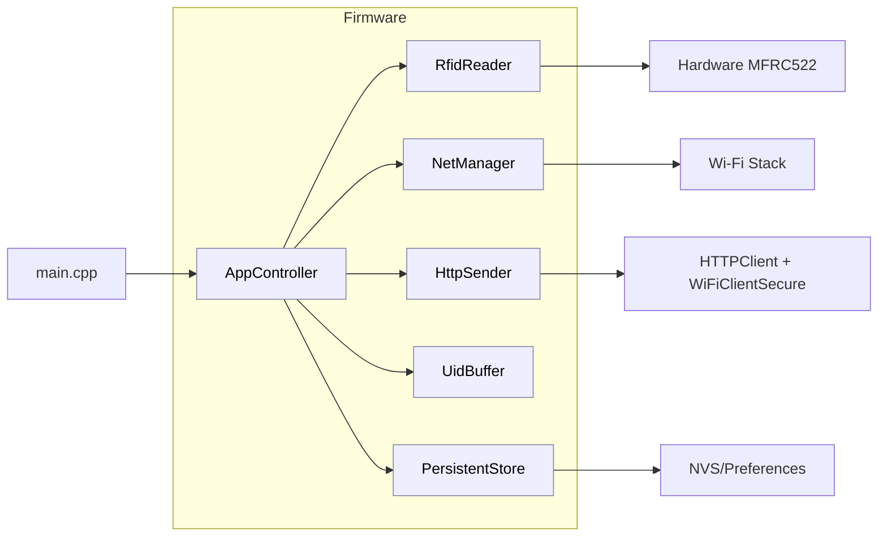
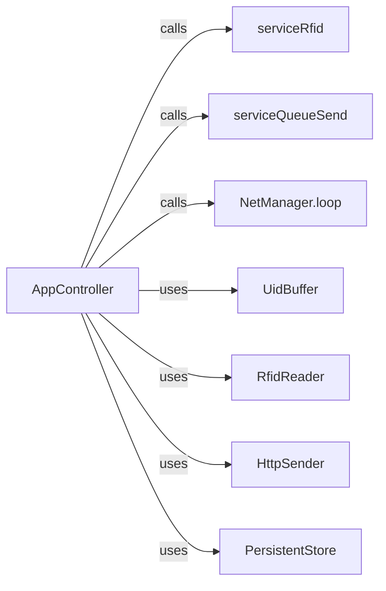
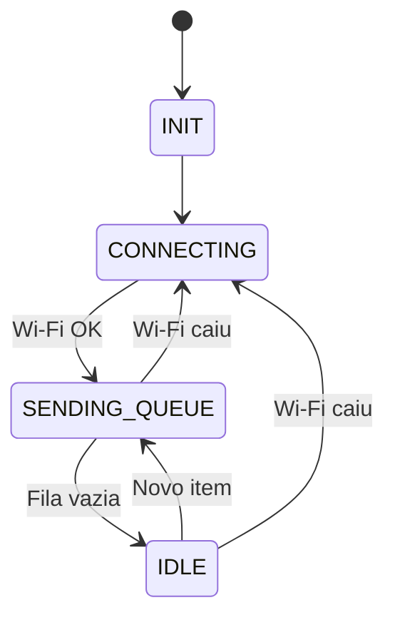
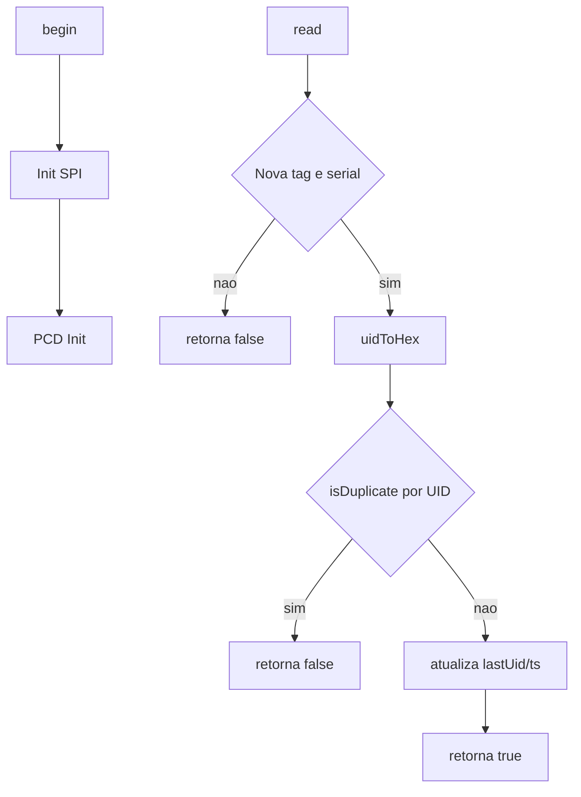
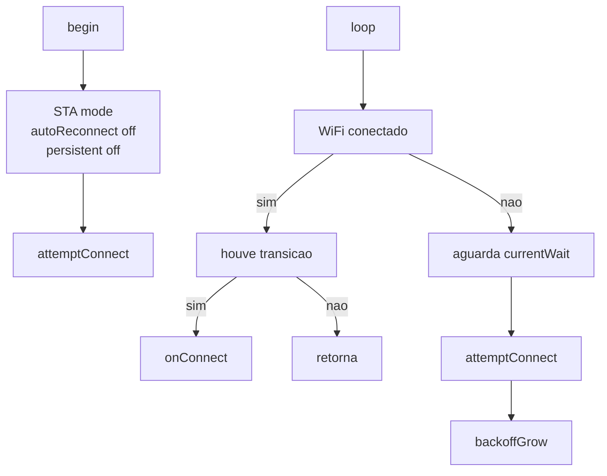
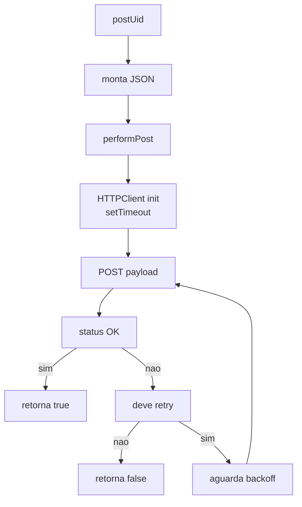
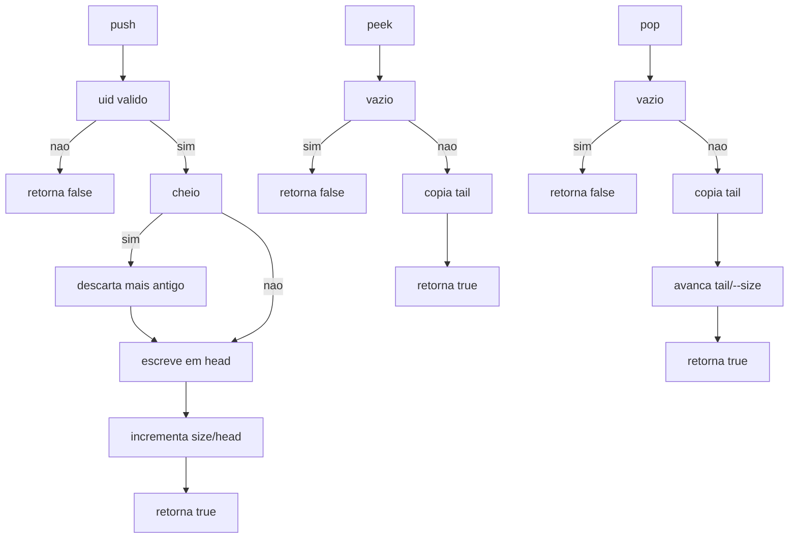
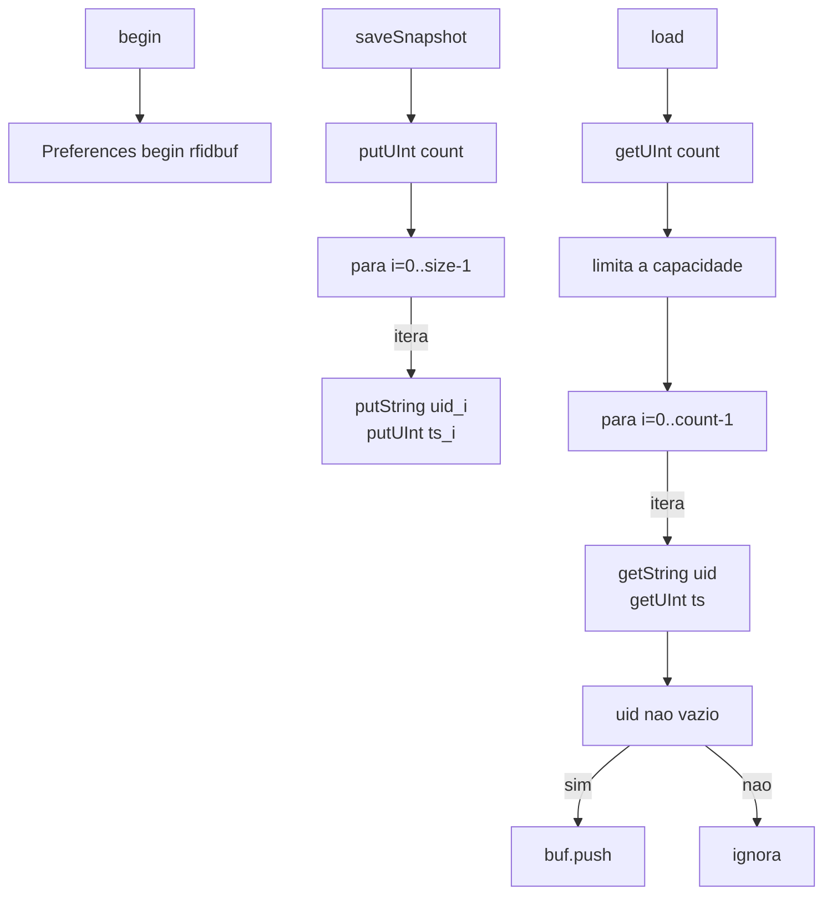

# ESP32 RFID Logger (MFRC522)

## Introdução
Firmware para ESP32 que lê UIDs de tags MIFARE (MFRC522), registra no Serial e envia via HTTP/HTTPS. Se a rede cair, continua lendo e guarda as UIDs em um buffer; quando a conexão volta, ele envia o que ficou pendente. Projeto baseado em PlatformIO (framework Arduino) para ESP32 DevKit.

## Autores
- Wesley Santos — https://github.com/wesleyiuri/

## Estrutura do repositório
```
RFID_MFRC522_ESP32_Logger/      # Raiz do projeto PlatformIO
├─ platformio.ini               # Configuração do build (env, flags, libs)
├─ README.md                    # Guia do projeto
├─ LICENSE                      # Licença (MIT)
├─ include/                     # Headers públicos (APIs)
│  ├─ AppController.h           # Orquestrador (FSM)
│  ├─ HttpSender.h              # Envio HTTP/HTTPS (POST)
│  ├─ Log.h                     # Macros de log por nível
│  ├─ NetManager.h              # Wi‑Fi (backoff)
│  ├─ PersistentStore.h         # Persistência NVS (snapshot)
│  ├─ ProjectConfig.example.h   # Exemplo de configuração
│  ├─ ProjectConfig.h           # Configuração do dispositivo
│  ├─ RfidDedupCache.h          # Deduplicação por UID
│  ├─ RfidReader.h              # Leitura MFRC522 + dedup
│  └─ UidBuffer.h               # Ring buffer de UIDs
├─ src/                         # Implementações e entry point
│  ├─ AppController.cpp         # FSM; coordena leitura/fila/rede
│  ├─ HttpSender.cpp            # POST HTTP/HTTPS, retries
│  ├─ NetManager.cpp            # Conexão Wi‑Fi e backoff
│  ├─ RfidReader.cpp            # Leitura MFRC522 e dedup
│  └─ main.cpp                  # setup()/loop(): inicializa e delega
├─ lib/                         # Bibliotecas locais
│  └─ README.md                 # Notas das libs locais
├─ docs/                        # Docs e diagramas
│  ├─ README.md                 # Índice dos docs
│  ├─ RELATORIO_PROJETO.md      # Relatório do projeto
│  └─ diagrams/                 # Diagramas Mermaid
│     ├─ appcontroller-fsm.mmd          # FSM do AppController
│     ├─ appcontroller-interactions.mmd # Interações do AppController
│     ├─ appcontroller.mmd              # Estrutura do AppController
│     ├─ architecture.mmd               # Arquitetura geral
│     ├─ httpsender.mmd                 # Fluxo do HttpSender
│     ├─ netmanager.mmd                 # Fluxo do NetManager
│     ├─ persistentstore.mmd            # Persistência NVS
│     ├─ rfidreader.mmd                 # Leitura RFID e dedup
│     └─ uidbuffer.mmd                  # Operações do ring buffer
└─ test/                        # Esqueleto de testes
  └─ README.md                  # Notas de testes
```

## Funcionalidades
- Leitura RFID (MFRC522, SPI) não‑bloqueante.
- Deduplicação por UID com janela configurável (cache + janela).
- Buffer circular em memória para operação offline (sem alocação dinâmica).
- Persistência opcional do buffer via NVS (Preferences).
- Envio HTTP/HTTPS de UIDs com backoff exponencial e política de retry configurável.
- Reconexão Wi‑Fi com backoff exponencial + jitter.
- LED de status configurável por pino.
- Logs por nível (ERROR/INFO/DEBUG) no Serial (115200).
- Parâmetros ajustáveis via build flags (PlatformIO) e `ProjectConfig.h`.

## Dependências
- Ferramentas
  - VS Code + extensão PlatformIO ou PlatformIO CLI
  - PlatformIO Platform: espressif32 (ESP32)
  - Framework: Arduino (arduino-esp32)
- Bibliotecas
  - MFRC522: `miguelbalboa/MFRC522 @ ^1.4.10`
  - Arduino‑ESP32 (nativas): WiFi, HTTPClient, WiFiClientSecure, Preferences (NVS)

## Hardware
Componentes:
- ESP32 DevKit (qualquer variante)
- Leitor RC522 (MFRC522) via SPI

Ligação sugerida (SPI):

| MFRC522 | ESP32 GPIO |
|---------|------------|
| SDA/SS  | 5          |
| SCK     | 18         |
| MOSI    | 23         |
| MISO    | 19         |
| RST     | 17         |

Você pode alterar os pinos em `include/ProjectConfig.h`.

## Instalação e configurações
1) Requisitos
- VS Code + PlatformIO (ou PlatformIO CLI).

2) Configuração do projeto
- Copie `include/ProjectConfig.example.h` para `include/ProjectConfig.h`.
- Preencha `WIFI_SSID`, `WIFI_PASSWORD`, `HTTP_ENDPOINT_URL` e demais campos.
- Ajuste pinos e parâmetros conforme seu hardware/ambiente.

3) Compilar e carregar
- Selecione a environment `esp32dev`.
- Compile e faça upload para a placa.
- Abra o Monitor Serial em 115200 baud.

4) Parâmetros via build_flags (em `platformio.ini`)
- `UID_BUFFER_CAPACITY` (1024): capacidade do buffer em memória (aprox. 1024 leituras offline antes de descartar a mais antiga; ~36 KB de RAM para dados de UID+timestamp).
- `FW_VERSION` (string): versão do firmware reportada no payload.
- `DEDUP_INTERVAL_MS` (30000): janela de deduplicação por UID (ms), suprime reenvio mesmo alternando UIDs.
- `DEDUP_CACHE_SIZE` (16): quantos UIDs distintos o cache de deduplicação mantém.
- `LOG_LEVEL` (0=OFF,1=ERROR,2=INFO,3=DEBUG): nível de logs.
- `PERSIST_BUFFER` (0/1): ativa persistência do buffer em NVS.
- `HTTP_RETRY_MAX` (0): nº de tentativas extras de POST.
- `HTTP_RETRY_BASE_DELAY_MS` (100): atraso base para backoff de retries.
- `STATUS_LED_PIN` (15 ou -1 para desativar): pino do LED de status.

## Comunicação
- Protocolo: HTTP/HTTPS — método POST para o endpoint configurado em `ProjectConfig.h`.
- Conteúdo: `application/json`.
- Timeouts e retries: configuráveis via `HTTP_RETRY_MAX` e `HTTP_RETRY_BASE_DELAY_MS` (backoff exponencial).
- Offline: UIDs ficam em buffer e são drenadas quando a conexão volta.
- HTTPS: configure a CA no `ProjectConfig.h` (WiFiClientSecure). Mantenha a CA atualizada.

Exemplo de payload JSON (campos exatos dependem de `ProjectConfig.h` e `HttpSender.cpp`):

```json
{
  "uid": "<UID>",
  "capture_timestamp_ms": 123456,
  "timestamp_ms": 456789,
  "timestamp_iso": "2025-11-09T12:34:56Z",
  "device_id": "<DEVICE_ID>",
  "site": "<SITE>",
  "unit": "<UNIDADE>",
  "sector": "<SETOR>",
  "firmware_version": "<FW_VERSION>",
  "operator_id": "<OPERATOR_ID>"
}
```

## Arquitetura do código

### Visão geral


Legenda:
- main.cpp: inicializa e entrega controle ao AppController
- AppController: FSM que coordena leitura, fila e envio
- RfidReader: lê MFRC522 (SPI) e deduplica UIDs
- NetManager: gerencia link Wi‑Fi e backoff de reconexão
- HttpSender: POST HTTP/HTTPS dos UIDs
- UidBuffer: fila circular (RAM) de UID+timestamp
- PersistentStore: snapshot do buffer na NVS
- Hardware MFRC522: leitor RC522 (SPI)
- Wi‑Fi Stack: rede Wi‑Fi do ESP32
- HTTPClient + WiFiClientSecure: cliente HTTP/TLS para POST
- NVS/Preferences: NVS (flash) para armazenamento persistente

### AppController — Interações


Legenda:
- AppController: orquestra ciclo principal
- serviceRfid: captura e enfileira UIDs
- serviceQueueSend: drena fila via HTTP enquanto online
- NetManager.loop: atualiza link e reconexão
- UidBuffer: armazena UIDs pendentes
- RfidReader: lê MFRC522 (UID)
- HttpSender: envia JSON para endpoint
- PersistentStore: salva/restaura buffer
- calls: chamada direta (síncrona)
- uses: usa API/serviço de outro módulo

### AppController — FSM


Legenda:
- INIT: inicialização do sistema
- CONNECTING: tentando conectar Wi‑Fi
- SENDING_QUEUE: enviando fila online
- IDLE: conectado, sem pendências

### RfidReader


Legenda:
- begin: inicializa RFID
- Init SPI: configura barramento SPI
- PCD Init: inicializa MFRC522
- read: tenta ler nova tag
- Nova tag e serial: presença + UID lido da tag
- retorna false: sem leitura válida (sem tag/UID)
- uidToHex: bytes UID → string HEX
- isDuplicate por UID: checa janela de dedup (tempo/cache)
- retorna false: duplicado descartado (na janela)
- atualiza lastUid/ts: atualiza UID/tempo mais recente
- retorna true: leitura aceita

### NetManager


Legenda:
- begin: inicia gerenciador
- STA mode: modo estação
- autoReconnect off: desativa auto‑reconexão automática
- persistent off: não salva credenciais no Wi‑Fi
- attemptConnect: tenta conectar ao AP
- loop: gerencia link e reconexão
- houve transicao: link mudou desde o último ciclo
- onConnect: notifica conexão estabelecida
- retorna: encerra ciclo sem ação adicional
- aguarda currentWait: espera janela atual antes da próxima tentativa
- attemptConnect: tenta conectar (novamente)
- backoffGrow: aumenta backoff exponencial com jitter

### HttpSender


Legenda:
- postUid: envia um item do buffer
- monta JSON: serializa UID/timestamps
- performPost: executa POST (HTTP/HTTPS)
- HTTPClient init: inicia cliente HTTP/TLS
- setTimeout: define timeouts HTTP/TLS
- POST payload: envia corpo JSON ao endpoint
- status OK: resposta 2xx
- retorna true: sucesso de envio
- deve retry: 5xx/timeout → tentar novamente
- retorna false: falha final (após retries)
- aguarda backoff: espera exponencial com jitter

### UidBuffer


Legenda:
- push: insere item
- uid valido: UID não vazio
- retorna false: UID vazio/ inválido
- cheio: buffer lotado
- descarta mais antigo: remove tail para abrir espaço
- escreve em head: grava elemento
- incrementa size/head: atualiza índices
- retorna true: inserção OK
- peek: lê sem remover
- vazio: sem itens
- retorna false: leitura falhou (vazio)
- copia tail: copia mais antigo
- retorna true: leitura OK
- pop: remove mais antigo
- vazio: sem itens
- retorna false: remoção falhou (vazio)
- copia tail: copia mais antigo
- avanca tail/--size: atualiza índices
- retorna true: remoção OK

### PersistentStore


Legenda:
- begin: inicia NVS
- Preferences begin rfidbuf: abre namespace
- saveSnapshot: grava snapshot
- putUInt count: salva contagem de itens
- para i=0..size-1: loop de gravação
- putString uid_i: salva UID_i
- putUInt ts_i: salva ts_i
- load: carrega snapshot
- getUInt count: lê contagem salva
- limita a capacidade: usa min(count, capacidade)
- para i=0..count-1: loop de leitura
- getString uid: lê UID_i
- getUInt ts: lê ts_i
- uid nao vazio: valida entrada (UID != vazio)
- buf.push: reinsere no buffer
- ignora: descarta entradas com UID vazio

## Licença (MIT)
Distribuído sob a licença MIT. Consulte o arquivo `LICENSE` na raiz do repositório para detalhes.

