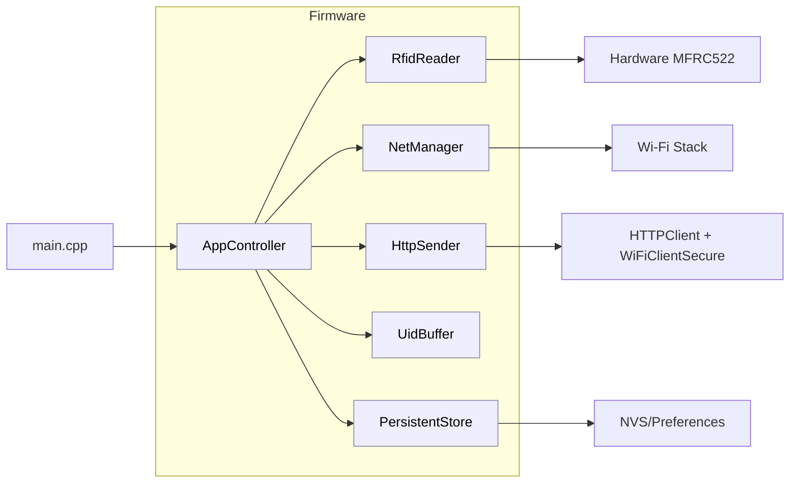
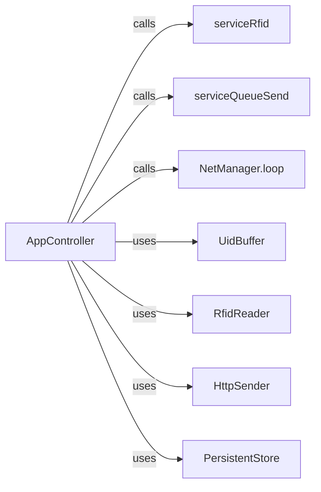
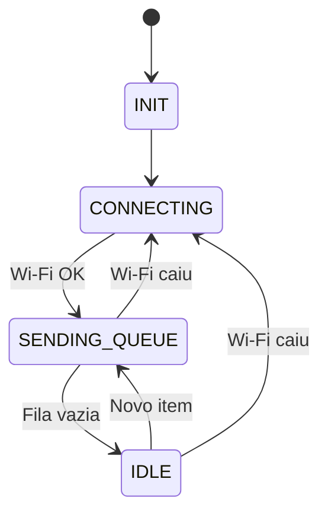
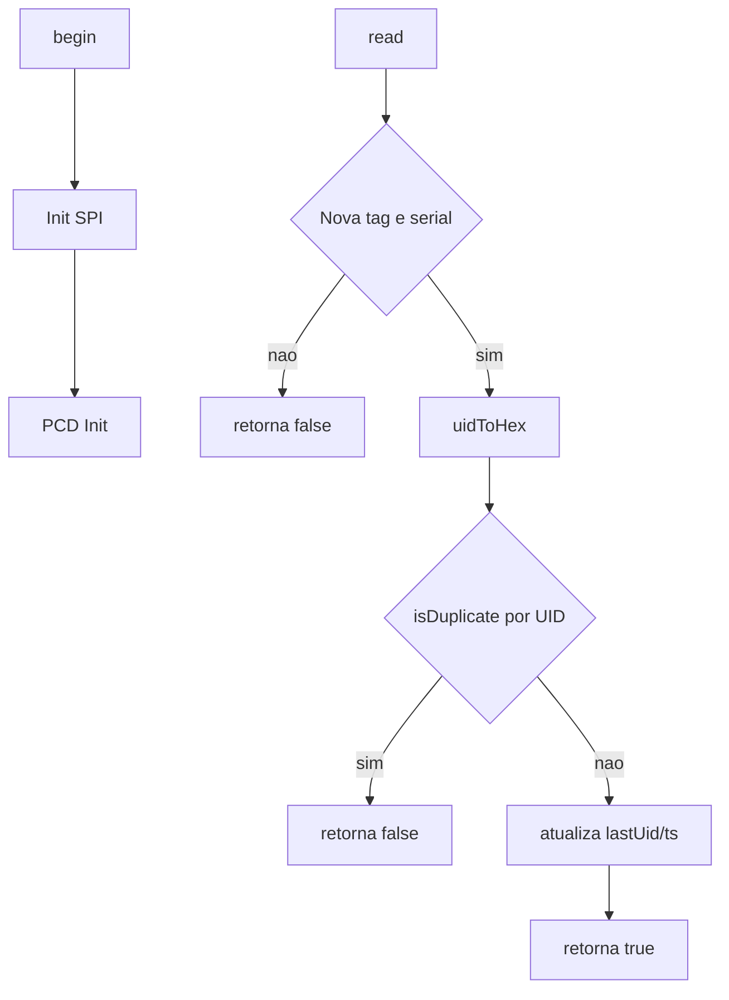
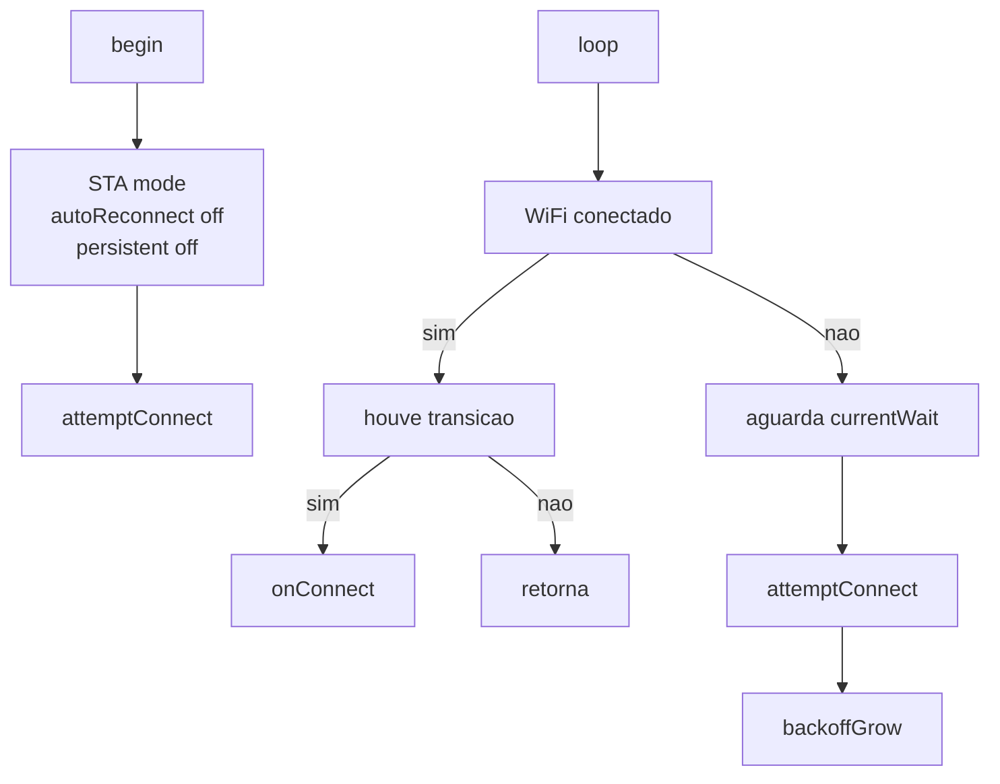
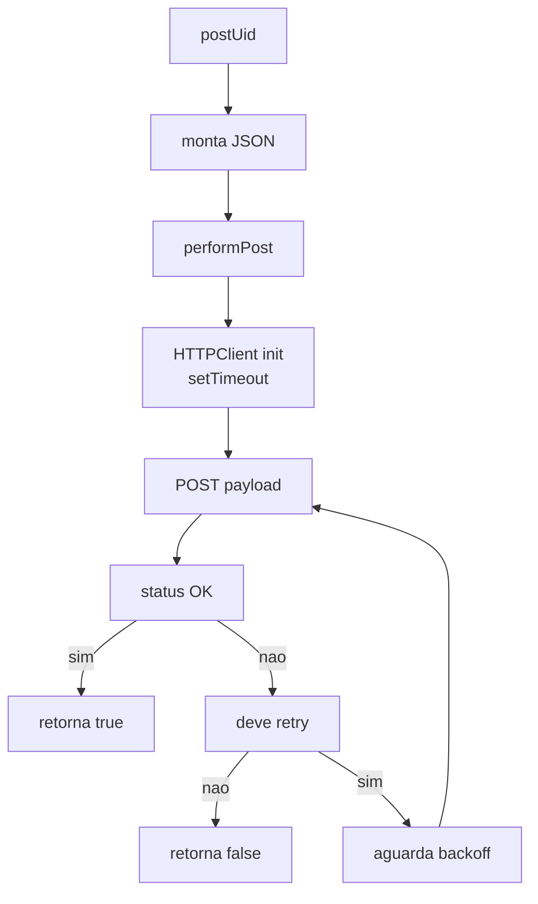
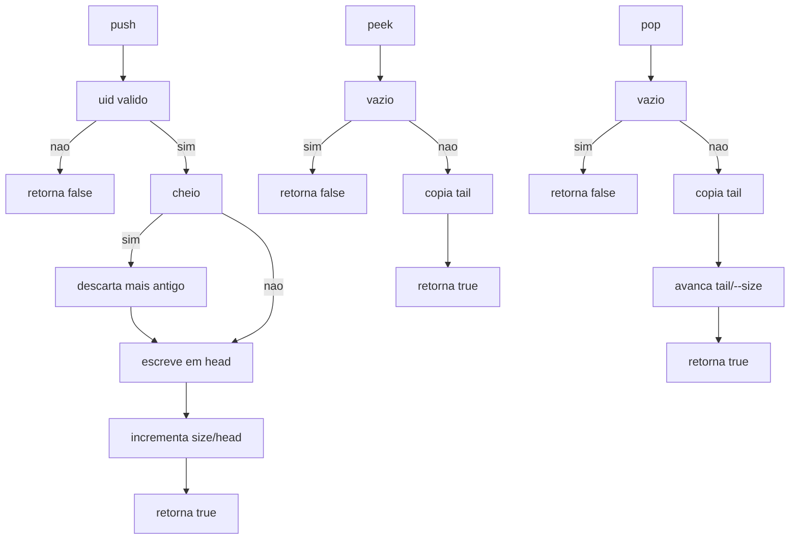
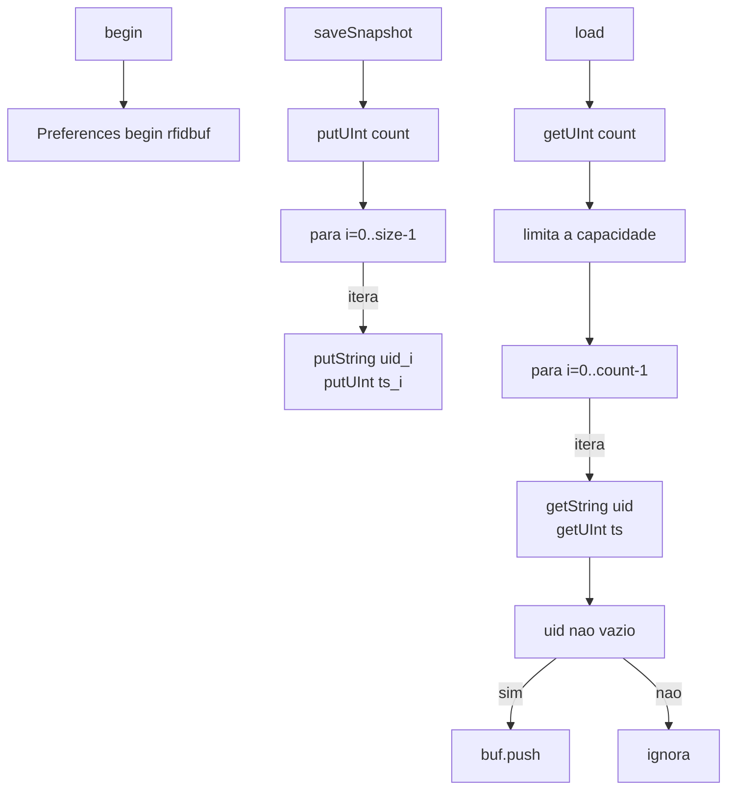

# Relatório do projeto: RFID_MFRC522_ESP32_Logger

- Data de geração: 2025-11-10
- Versão do relatório: v1.0.0

## Introdução
Firmware para ESP32 que lê UIDs de tags MIFARE (MFRC522), registra no Serial e envia via HTTP/HTTPS. Se a rede cair, continua lendo e guarda as UIDs em um buffer; quando a conexão volta, ele envia o que ficou pendente. Projeto baseado em PlatformIO (framework Arduino) para ESP32 DevKit.

## Autores
- Wesley Santos — https://github.com/wesleyiuri/

## Estrutura do repositório
```
RFID_MFRC522_ESP32_Logger/      # Raiz do projeto PlatformIO
├─ platformio.ini               # Configuração do build (env, flags, libs)
├─ README.md                    # Guia do projeto
├─ LICENSE                      # Licença (MIT)
├─ include/                     # Headers públicos (APIs)
│  ├─ AppController.h           # Orquestrador (FSM)
│  ├─ HttpSender.h              # Envio HTTP/HTTPS (POST)
│  ├─ Log.h                     # Macros de log por nível
│  ├─ NetManager.h              # Wi‑Fi (backoff)
│  ├─ PersistentStore.h         # Persistência NVS (snapshot)
│  ├─ ProjectConfig.example.h   # Exemplo de configuração
│  ├─ ProjectConfig.h           # Configuração do dispositivo
│  ├─ RfidDedupCache.h          # Deduplicação por UID
│  ├─ RfidReader.h              # Leitura MFRC522 + dedup
│  └─ UidBuffer.h               # Ring buffer de UIDs
├─ src/                         # Implementações e entry point
│  ├─ AppController.cpp         # FSM; coordena leitura/fila/rede
│  ├─ HttpSender.cpp            # POST HTTP/HTTPS, retries
│  ├─ NetManager.cpp            # Conexão Wi‑Fi e backoff
│  ├─ RfidReader.cpp            # Leitura MFRC522 e dedup
│  └─ main.cpp                  # setup()/loop(): inicializa e delega
├─ lib/                         # Bibliotecas locais
│  └─ README.md                 # Notas das libs locais
├─ docs/                        # Docs e diagramas
│  ├─ README.md                 # Índice dos docs
│  ├─ RELATORIO_PROJETO.md      # Relatório do projeto
│  └─ diagrams/                 # Diagramas Mermaid
│     ├─ appcontroller-fsm.mmd          # FSM do AppController
│     ├─ appcontroller-interactions.mmd # Interações do AppController
│     ├─ appcontroller.mmd              # Estrutura do AppController
│     ├─ architecture.mmd               # Arquitetura geral
│     ├─ httpsender.mmd                 # Fluxo do HttpSender
│     ├─ netmanager.mmd                 # Fluxo do NetManager
│     ├─ persistentstore.mmd            # Persistência NVS
│     ├─ rfidreader.mmd                 # Leitura RFID e dedup
│     └─ uidbuffer.mmd                  # Operações do ring buffer
└─ test/                        # Esqueleto de testes
  └─ README.md                  # Notas de testes
```

## Funcionalidades
- Leitura RFID (MFRC522, SPI) não‑bloqueante: o loop principal nunca fica preso esperando uma tag; a leitura é tentada rapidamente e retorna imediatamente se não houver cartão, mantendo o restante dos serviços responsivos.
- Deduplicação por UID com janela configurável (cache + janela): cada UID aceito é lembrado em um cache por um intervalo (ex.: 30 s); novas aparições dentro desse período são descartadas para evitar spam e reduzir consumo de rede/log.
- Buffer circular em memória para operação offline (sem alocação dinâmica): armazena leituras em um ring buffer pré‑alocado, evitando fragmentação e garantindo inserção/remoção O(1); em overflow descarta o mais antigo para continuar operando.
- Persistência opcional do buffer via NVS (Preferences): quando habilitado, faz snapshot periódico/condicional do estado da fila (UID + timestamp) na flash; após reinício, restaura itens pendentes respeitando a capacidade atual.
- Envio HTTP/HTTPS de UIDs com backoff exponencial e política de retry configurável: cada UID é enviado isoladamente; falhas transitórias (timeout, 5xx, 429) podem disparar novas tentativas com atraso crescente e jitter para suavizar carga no servidor.
- Reconexão Wi‑Fi com backoff exponencial + jitter: após queda de link, o tempo entre tentativas cresce até um teto; adiciona variação pseudo‑aleatória para evitar sincronização com outros dispositivos.
- LED de status configurável por pino: permite indicar estados (ex.: conectado, enviando) sem impactar lógica central; pode ser desativado definindo pino -1.
- Logs por nível (ERROR/INFO/DEBUG) no Serial (115200): controlados por `LOG_LEVEL`, auxiliam diagnóstico em campo; níveis maiores incluem rastros detalhados de fluxo (dedup, retries, backoff).
- Parâmetros ajustáveis via build flags (PlatformIO) e `ProjectConfig.h`: tornam o firmware adaptável (capacidade de buffer, janela de dedup, retries HTTP, versão, metadados) sem modificar código fonte.

## Dependências
- Ferramentas
  - VS Code + extensão PlatformIO ou PlatformIO CLI
  - PlatformIO Platform: espressif32 (ESP32)
  - Framework: Arduino (arduino-esp32)
- Bibliotecas
  - MFRC522: `miguelbalboa/MFRC522 @ ^1.4.10`
  - Arduino‑ESP32 (nativas): WiFi, HTTPClient, WiFiClientSecure, Preferences (NVS)

## Hardware
Componentes:
- ESP32 DevKit (qualquer variante)
- Leitor RC522 (MFRC522) via SPI

Ligação sugerida (SPI):

| MFRC522 | ESP32 GPIO |
|---------|------------|
| SDA/SS  | 5          |
| SCK     | 18         |
| MOSI    | 23         |
| MISO    | 19         |
| RST     | 17         |

Você pode alterar os pinos em `include/ProjectConfig.h`.

## Instalação e configurações
1) Requisitos
- VS Code + PlatformIO (ou PlatformIO CLI).

2) Configuração do projeto
- Copie `include/ProjectConfig.example.h` para `include/ProjectConfig.h`.
- Preencha `WIFI_SSID`, `WIFI_PASSWORD`, `HTTP_ENDPOINT_URL` e demais campos.
- Ajuste pinos e parâmetros conforme seu hardware/ambiente.

3) Compilar e carregar
- Selecione a environment `esp32dev`.
- Compile e faça upload para a placa.
- Abra o Monitor Serial em 115200 baud.

4) Parâmetros via build_flags (em `platformio.ini`)
- `UID_BUFFER_CAPACITY` (1024): capacidade do buffer em memória (aprox. 1024 leituras offline antes de descartar a mais antiga; ~36 KB de RAM para dados de UID+timestamp).
- `FW_VERSION` (string): versão do firmware reportada no payload.
- `DEDUP_INTERVAL_MS` (30000): janela de deduplicação por UID (ms), suprime reenvio mesmo alternando UIDs.
- `DEDUP_CACHE_SIZE` (16): quantos UIDs distintos o cache de deduplicação mantém.
- `LOG_LEVEL` (0=OFF,1=ERROR,2=INFO,3=DEBUG): nível de logs.
- `PERSIST_BUFFER` (0/1): ativa persistência do buffer em NVS.
- `HTTP_RETRY_MAX` (0): nº de tentativas extras de POST.
- `HTTP_RETRY_BASE_DELAY_MS` (100): atraso base para backoff de retries.
- `STATUS_LED_PIN` (15 ou -1 para desativar): pino do LED de status.

## Comunicação
- Protocolo: HTTP/HTTPS — método POST para o endpoint configurado em `ProjectConfig.h`.
- Conteúdo: `application/json`.
- Timeouts e retries: configuráveis via `HTTP_RETRY_MAX` e `HTTP_RETRY_BASE_DELAY_MS` (backoff exponencial).
- Offline: UIDs ficam em buffer e são drenadas quando a conexão volta.
- HTTPS: configure a CA no `ProjectConfig.h` (WiFiClientSecure). Mantenha a CA atualizada.

Exemplo de payload JSON (campos exatos dependem de `ProjectConfig.h` e `HttpSender.cpp`):

```json
{
  "uid": "<UID>",
  "capture_timestamp_ms": 123456,
  "timestamp_ms": 456789,
  "timestamp_iso": "2025-11-09T12:34:56Z",
  "device_id": "<DEVICE_ID>",
  "site": "<SITE>",
  "unit": "<UNIDADE>",
  "sector": "<SETOR>",
  "firmware_version": "<FW_VERSION>",
  "operator_id": "<OPERATOR_ID>"
}
```

## Arquitetura do código

### Visão geral


Legenda:
- main.cpp: inicializa e entrega controle ao AppController
- AppController: FSM que coordena leitura, fila e envio
- RfidReader: lê MFRC522 (SPI) e deduplica UIDs
- NetManager: gerencia link Wi‑Fi e backoff de reconexão
- HttpSender: POST HTTP/HTTPS dos UIDs
- UidBuffer: fila circular (RAM) de UID+timestamp
- PersistentStore: snapshot do buffer na NVS
- Hardware MFRC522: leitor RC522 (SPI)
- Wi‑Fi Stack: rede Wi‑Fi do ESP32
- HTTPClient + WiFiClientSecure: cliente HTTP/TLS para POST
- NVS/Preferences: NVS (flash) para armazenamento persistente

Explicação detalhada: O `main.cpp` inicia o `AppController`, que instancia e coordena todos os módulos. O `RfidReader` interage com o MFRC522 via SPI e, ao obter um UID válido (não duplicado), insere no `UidBuffer`. O `NetManager` ajusta o estado de conectividade Wi‑Fi; quando o link está estabelecido, o `AppController` aciona o `HttpSender` para enviar o item mais antigo do buffer mantendo ordem FIFO. Se a persistência estiver ativa, o `PersistentStore` faz snapshots periódicos ou condicionais (após push/pop) garantindo que, após reinício, leituras não enviadas sejam recuperadas. Componentes externos (`Wi‑Fi Stack`, `HTTPClient/TLS`, `NVS`) sustentam operações de rede e armazenamento durável.

### AppController — Interações


Legenda:
- AppController: orquestra ciclo principal
- serviceRfid: captura e enfileira UIDs
- serviceQueueSend: drena fila via HTTP enquanto online
- NetManager.loop: atualiza link e reconexão
- UidBuffer: armazena UIDs pendentes
- RfidReader: lê MFRC522 (UID)
- HttpSender: envia JSON para endpoint
- PersistentStore: salva/restaura buffer
- calls: chamada direta (síncrona)
- uses: usa API/serviço de outro módulo

Explicação detalhada: O `AppController::loop()` executa um ciclo curto: 1) chama `serviceRfid` para tentar captura (rápida, não bloqueante); 2) chama `NetManager.loop` para atualizar transições de link e possivelmente disparar callbacks; 3) se conectado e há itens pendentes, invoca `serviceQueueSend` para envio unitário. O uso de `calls` indica invocação direta dentro do mesmo tick; `uses` mostra dependências internas (módulos colaboram mas não dirigem o fluxo). Essa separação reduz acoplamento e facilita testes de cada serviço.

### AppController — FSM


Legenda:
- INIT: inicialização do sistema
- CONNECTING: tentando conectar Wi‑Fi
- SENDING_QUEUE: enviando fila online
- IDLE: conectado, sem pendências

Explicação detalhada: Estado `INIT` prepara componentes e decide a transição imediata para `CONNECTING`. Em `CONNECTING`, o sistema só tenta estabelecer link Wi‑Fi; novas leituras ainda são armazenadas. Ao confirmar link (evento de transição detectado pelo `NetManager`), passa para `SENDING_QUEUE`, onde prioriza drenagem do buffer, respeitando cadência e limite de retries. Quando o buffer zera, migra para `IDLE`, reduzindo atividade de envio e economizando rede. Queda do Wi‑Fi em qualquer estado força retorno para `CONNECTING`, garantindo tentativa de reconexão com backoff. Chegada de novo item em `IDLE` reativa `SENDING_QUEUE` rapidamente para minimizar latência de entrega.

### RfidReader


Legenda:
- begin: inicializa RFID
- Init SPI: configura barramento SPI
- PCD Init: inicializa MFRC522
- read: tenta ler nova tag
- Nova tag e serial: presença + UID lido da tag
- retorna false: sem leitura válida (sem tag/UID)
- uidToHex: bytes UID → string HEX
- isDuplicate por UID: checa janela de dedup (tempo/cache)
- retorna false: duplicado descartado (na janela)
- atualiza lastUid/ts: atualiza UID/tempo mais recente
- retorna true: leitura aceita

Explicação detalhada: O fluxo de leitura começa com a inicialização do barramento SPI e da lógica interna do MFRC522 (registro, antena). Em cada tentativa de `read`, o módulo pergunta se há tag presente e recupera o UID bruto; ausência resulta em retorno imediato (false) sem custo elevado. Para tags presentes, converte o UID para string hexadecimal consistente que alimenta deduplicação e transmissão. A verificação de duplicidade usa cache com timestamps; se o UID recente ainda está na janela configurada o evento é descartado (false). Caso contrário, atualiza o marcador `lastUid/ts` e retorna sucesso (true). Edge cases: UID parcial ou falha de CRC retornam como sem leitura; janela muito pequena pode gerar alto volume de eventos; janela muito grande pode eliminar leituras legítimas repetidas.

### NetManager


Legenda:
- begin: inicia gerenciador
- STA mode: modo estação
- autoReconnect off: desativa auto‑reconexão automática
- persistent off: não salva credenciais no Wi‑Fi
- attemptConnect: tenta conectar ao AP
- loop: gerencia link e reconexão
- houve transicao: link mudou desde o último ciclo
- onConnect: notifica conexão estabelecida
- retorna: encerra ciclo sem ação adicional
- aguarda currentWait: espera janela atual antes da próxima tentativa
- attemptConnect: tenta conectar (novamente)
- backoffGrow: aumenta backoff exponencial com jitter

Explicação detalhada: Ao entrar em `begin`, define modo estação e desativa auto‑reconexão/persistência para ter controle explícito. Cada `attemptConnect` registra o instante de tentativa; falha resulta em espera (`currentWait`) antes da próxima tentativa. O `backoffGrow` aumenta progressivamente esse intervalo (exponencial) adicionando jitter para evitar colisões com outros dispositivos competindo pelo AP, ajudando a preservar estabilidade do roteador. `loop` detecta transições (desconectado→conectado) disparando `onConnect` para permitir inicializações dependentes (ex.: NTP, flush pendente). Em desconexão, o ciclo volta a crescer o backoff. Edge cases: AP indisponível prolonga backoff até o teto; credenciais inválidas mantêm tentativas espaçadas sem travar o restante do sistema.

### HttpSender


Legenda:
- postUid: envia um item do buffer
- monta JSON: serializa UID/timestamps
- performPost: executa POST (HTTP/HTTPS)
- HTTPClient init: inicia cliente HTTP/TLS
- setTimeout: define timeouts HTTP/TLS
- POST payload: envia corpo JSON ao endpoint
- status OK: resposta 2xx
- retorna true: sucesso de envio
- deve retry: 5xx/timeout → tentar novamente
- retorna false: falha final (após retries)
- aguarda backoff: espera exponencial com jitter

Explicação detalhada: `postUid` transforma a entrada do buffer em JSON minimalista incluindo metadados e timestamps. `performPost` prepara `HTTPClient` (ou `WiFiClientSecure` para TLS) aplicando timeout global. Após envio (`POST payload`), avalia código HTTP: respostas 2xx liberam o item (true). Erros considerados transitórios (5xx, 429, timeout) podem acionar `deve retry`; o backoff escalonado reduz carga no servidor sob stress. Limite de tentativas evita loops intermináveis — falha final retorna false e mantém item no buffer para futura tentativa quando outro ciclo ocorrer. Segurança: com HTTPS e CA validada, falhas de handshake geram retry conforme política. Edge cases: perda de conexão durante envio resulta em fallback semelhante a timeout.

### UidBuffer


Legenda:
- push: insere item
- uid valido: UID não vazio
- retorna false: UID vazio/ inválido
- cheio: buffer lotado
- descarta mais antigo: remove tail para abrir espaço
- escreve em head: grava elemento
- incrementa size/head: atualiza índices
- retorna true: inserção OK
- peek: lê sem remover
- vazio: sem itens
- retorna false: leitura falhou (vazio)
- copia tail: copia mais antigo
- retorna true: leitura OK
- pop: remove mais antigo
- vazio: sem itens
- retorna false: remoção falhou (vazio)
- copia tail: copia mais antigo
- avanca tail/--size: atualiza índices
- retorna true: remoção OK

Explicação detalhada: O ring buffer reserva blocos fixos para UID e timestamp. `push` valida entrada; se cheio, o algoritmo sobrescreve o item mais antigo (tail) garantindo continuidade — estratégia que prioriza eventos mais recentes em cenários de saturação. `peek` oferece leitura sem consumo, útil para tentativa de envio; `pop` remove após confirmação. Índices head/tail são incrementados modularmente (wrap‑around), e o tamanho é ajustado sem realocação. Essa abordagem é constante em tempo (O(1)) e evita fragmentação. Edge cases: repetidas falhas de envio com alta taxa de captura podem causar perda dos UIDs mais antigos se o buffer permanecer sempre cheio; capacity tuning mitiga.

### PersistentStore


Legenda:
- begin: inicia NVS
- Preferences begin rfidbuf: abre namespace
- saveSnapshot: grava snapshot
- putUInt count: salva contagem de itens
- para i=0..size-1: loop de gravação
- putString uid_i: salva UID_i
- putUInt ts_i: salva ts_i
- load: carrega snapshot
- getUInt count: lê contagem salva
- limita a capacidade: usa min(count, capacidade)
- para i=0..count-1: loop de leitura
- getString uid: lê UID_i
- getUInt ts: lê ts_i
- uid nao vazio: valida entrada (UID != vazio)
- buf.push: reinsere no buffer
- ignora: descarta entradas com UID vazio

Explicação detalhada: Ao salvar (`saveSnapshot`), grava primeiro a contagem total, depois iterativamente cada UID e timestamp em chaves indexadas estáveis. Recuperação (`load`) lê a contagem, aplica clamp à capacidade atual (evita overflow) e re‑insere apenas UIDs não vazios. Essa persistência é desenhada para tolerar interrupção de energia — na pior hipótese, snapshot parcial resulta em alguns itens ignorados sem corromper espaço de nomes. Frequência de snapshots deve balancear desgaste da flash vs. resiliência (NVS usa wear leveling, mas limites físicos existem). Edge cases: mudança de capacidade entre versões do firmware faz clamp; UIDs vazios (corrupção ou versão antiga) são descartados.

## Melhorias futuras sugeridas
1) Envio em lote (reduz requisições e latência)
2) HTTPS com verificação de certificado (produção) e opção de pinning
3) Modo manutenção via Serial para inspeção/limpeza da fila
4) Painel web local de status (conexão, fila, últimos envios)
5) Testes automatizados para HttpSender usando servidor de teste

## Conclusão
O sistema lê UIDs, evita duplicidade, armazena com resiliência e envia quando online. A arquitetura modular facilita manutenção e evolução, mantendo robustez mesmo offline.

## Perguntas frequentes
- Vai ler o mesmo cartão várias vezes? Não. A janela de deduplicação (padrão 30 s) ignora repetições.
- E se faltar internet? As leituras ficam no buffer e serão enviadas quando a conexão voltar, em ordem.
- Manda dados pessoais? Não por padrão; apenas UID e metadados do dispositivo/local.
- Posso usar HTTPS? Sim. Em produção, use `HTTPS_SECURITY_MODE=1` e configure a CA em `ProjectConfig.h`.
- Consome muita memória? Com as configurações padrão, há ampla margem de RAM/Flash para evoluções moderadas.

## Glossário
- RFID: identificação por radiofrequência
- UID: identificador único da tag/cartão
- Firmware: programa que roda no ESP32
- NVS/Preferences: armazenamento persistente na flash
- HTTP/HTTPS: protocolos de aplicação (HTTPS com TLS)
- JSON: formato textual para troca de dados
- Buffer/Fila: estrutura para armazenar itens em ordem
- Deduplicação: supressão de eventos repetidos em janela de tempo
- FSM: máquina de estados finita (controle de fluxo)
- Backoff: aumento do tempo de espera entre tentativas

## Apêndice

Nesta seção listamos, arquivo por arquivo, as funções principais e auxiliares.

### AppController.h/.cpp
- AppController::AppController(): constrói objeto, inicializa referências para módulos (RFID, rede, envio, buffer, persistência) sem iniciar hardware.
- AppController::begin(): inicializa log Serial, opcional LED, carrega snapshot (se persistência ativa), inicia leitor RFID e Wi‑Fi, agenda sincronização NTP na primeira conexão para timestamps consistentes.
- AppController::loop(): executa ciclo curto de orquestração chamando serviços; implementa lógica de transição entre estados (INIT → CONNECTING → SENDING_QUEUE ↔ IDLE) conforme conectividade e itens na fila.
- AppController::serviceRfid(): tenta captura; se UID novo (não duplicado), insere no buffer e dispara snapshot se persistência habilitada.
- AppController::serviceQueueSend(): se conectado e há item pendente, prepara e envia; em sucesso executa pop e snapshot; respeita espaçamento temporal mínimo entre envios.
- enum class State { INIT, CONNECTING, SENDING_QUEUE, IDLE }: define fases de operação; transições guiadas por eventos de link e estado do buffer.

### RfidReader.h/.cpp
- RfidReader::RfidReader(uint8_t sda, uint8_t rst): armazena pinos de SS e RST para inicialização posterior.
- RfidReader::begin(): configura SPI, ativa MFRC522 (antenna, registros) e prepara para leitura contínua.
- RfidReader::read(char* outHex, size_t outLen, uint32_t& captureMs): tenta detectar tag; se válida e não duplicada, escreve UID em HEX em outHex, define captureMs e retorna true.
- RfidReader::isDuplicate(const char* hex, uint32_t now): consulta cache de dedup para saber se UID dentro da janela; true indica descartar evento.
- RfidReader::uidToHex(const MFRC522::Uid& uid, char* out, size_t outLen): converte bytes para string uppercase sem separadores, garantindo formato consistente.
- RfidReader::nibbleHex(uint8_t n): utilitário interno para mapear 0–15 em caractere hexadecimal.

### RfidDedupCache.h
- RfidDedupCache::RfidDedupCache(): inicializa estrutura interna limpando slots e timestamps.
- RfidDedupCache::clear(): zera todos os registros permitindo nova janela limpa.
- RfidDedupCache::isDuplicate(const char* uidHex, uint32_t now): verifica se UID existe e se (now - ts) < intervalo; retorna true para suprimir leitura.
- RfidDedupCache::remember(const char* uidHex, uint32_t now): insere ou atualiza slot com timestamp atual para marcar presença do UID.
- RfidDedupCache::contains(const char* uidHex): retorna true se UID armazenado (independente de expiração temporal).
- RfidDedupCache::findIndex(const char* uidHex) [privada]: busca linear pelo índice do UID ou -1.
- RfidDedupCache::writeSlot(int i, const char* uidHex, uint32_t now) [privada]: grava UID e timestamp em posição i (reutiliza slot existente ou substitui).

### UidBuffer.h
- UidBuffer::UidBuffer(): inicializa índices head/tail e size=0.
- UidBuffer::push(const char* uidHex, uint32_t captureMs): valida UID; insere no head; se cheio, avança tail para descartar mais antigo.
- UidBuffer::peek(UidEntry& out) const: copia item mais antigo (tail) sem alterar estado; retorna false se vazio.
- UidBuffer::pop(UidEntry& out): remove item mais antigo, decrementa size e avança tail; retorna false se vazio.
- UidBuffer::isEmpty() const: verifica size==0.
- UidBuffer::size() const: retorna quantidade atual de itens armazenados.
- UidBuffer::capacity() const: retorna capacidade máxima configurada em tempo de compilação.
- UidBuffer::getAt(size_t indexFromOldest, UidEntry& out) const: acessa item relativo (0=tail) sem modificar estrutura; útil para inspeção/debug.
- UidBuffer::toJson(const UidEntry& e) const: gera representação mínima JSON de um item (UID + timestamp de captura).

### HttpSender.h/.cpp
- HttpSender::HttpSender(uint32_t timeoutMs): armazena timeout base para operações HTTP/TLS.
- HttpSender::postUid(const UidEntry& entry): monta payload com metadados e tenta enviar aplicando política de retries.
- HttpSender::performPost(const String& payload, const String& url, int& httpCode) [privada]: executa requisição POST; devolve código HTTP obtido.
- HttpSender::shouldRetry(int httpCode, uint8_t attempt) const [privada]: decide repetição baseado em código (ex.: 5xx, 429) e número da tentativa.

### NetManager.h/.cpp
- NetManager::NetManager(unsigned long baseRetryMs, unsigned long maxRetryMs): configura janelas inicial e máxima de backoff.
- NetManager::begin(): aplica configurações Wi‑Fi e dispara primeira tentativa de conexão.
- NetManager::loop(): avalia status atual, detecta transições e agenda novas tentativas conforme temporização.
- NetManager::isConnected() const: retorna estado booleano médio (link ativo) usado por outros módulos.
- NetManager::onConnect(const std::function<void()>& cb): registra callback disparado após confirmar conexão.
- NetManager::onDisconnect(const std::function<void()>& cb): registra callback disparado em perda de link.
- NetManager::attemptConnect() [privada]: inicia procedimento de conexão de baixo nível (WiFi.begin) e registra timestamp.
- NetManager::backoffGrow() [privada]: ajusta janela de espera multiplicando fator e aplicando limite máximo + jitter.

### PersistentStore.h
- PersistentStore::begin(): abre namespace NVS para futuras operações.
- PersistentStore::saveSnapshot(const UidBuffer& buf): grava contagem e pares UID/timestamp em chaves indexadas.
- PersistentStore::load(UidBuffer& buf): reconstrói fila lendo contagem e reinserindo UIDs válidos até capacidade.

### Log.h (macros)
- LOG_ERROR(fmt, ...): registra erros críticos.
- LOG_INFO(fmt, ...): registra eventos informativos (conexão, envio, leitura).
- LOG_DEBUG(fmt, ...): registra detalhes de fluxo (backoff, dedup, payload) para diagnóstico avançado.

### main.cpp (Arduino)
- setup(): instancia e chama `AppController.begin()` realizando bootstrap do sistema.
- loop(): delega controle ao `AppController::loop()` perpetuamente para manutenção de serviços.

### Outros arquivos
- ProjectConfig.h: concentra segredos e metadados (SSID, senha, endpoint, IDs).
- platformio.ini: define ambiente de build, dependências e flags de compilação.
